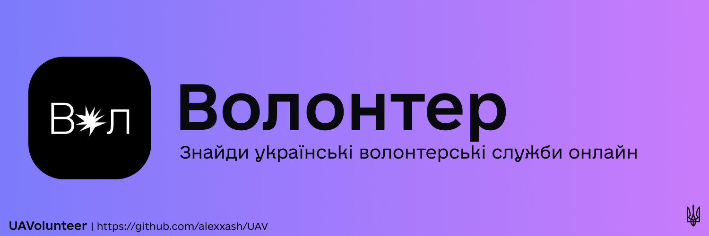

# UAV

UAVolunteer: Об'єднуй, Допомагай, Волонтер – З'єднує серця, Трансформує життя в Україні!

* [Особливості](#Особливості)
* [Автори](#Автори)
* [Ліцензія](#Ліцензія)
* [Початок роботи](#Початок-роботи)
* [Сприяння](#Сприяння)
* [Часті питання](#Часті-питання)
* [Скріншоти](#Скріншоти)
* [Зворотний зв'язок](#Зворотний-звязок)

## Особливості

#### Аутентифікація користувача:
- Дозволяє користувачам створювати облікові записи, безпечно входити та налаштовувати свої волонтерські вподобання.
#### Інтеграція карт:
- Використовуйте MapKit від Apple для візуального відображення можливостей волонтерства по всій Україні. Користувачі легко можуть досліджувати та знаходити поблизу волонтерські послуги.
#### SoundKit для покращеного досвіду:
- Покращуйте користувацький досвід інтеграцією SoundKit, надаючи значущі аудіо сигнали та сповіщення, щоб утримувати волонтерів інформованими та залученими.
#### Інтеграція Firebase:
- Використовуйте Firebase від Google для міцної інфраструктури на боці сервера, включаючи Firestore для безшовного зберігання та витягування даних.
#### Пошук та відкриття:
- Впроваджуйте потужну функціональність пошуку, щоб допомогти користувачам відкривати волонтерські можливості на основі їхніх вподобань та інтересів.
#### Оновлення в реальному часі:
- Тримайте користувачів в курсі останніх можливостей для волонтерства та оновлень за допомогою можливостей реальної бази даних Firebase.

І багато іншого! Щоб отримати всі функції, звертайтеся: uavolunteer.faq@gmail.com

## Автор

- [Олександр Балла](https://www.github.com/aiexxash)

## Ліцензія

[GNU GENERAL PUBLIC LICENSE](https://github.com/aiexxash/UAV/blob/main/LICENSE)

## Початок роботи

Щоб розпочати роботу з UAVolunteer, дотримуйтеся цих кроків:

1. **Клонувати репозиторій:**
    - git clone https://github.com/aiexxash/uavolunteer.git
2. **Встановити залежності:**
    - pod install
3. **Відкрити робочий простір Xcode:**
    - open UAVolunteer.xcworkspace
4. **Зібрати та запустити додаток на своєму пристрої iOS або симуляторі.**

## Сприяння

Внески завжди вітаються!

Дивіться `contributing.md` для початку або пишіть DM за адресою uavolunteer.faq@gmail.com

## Часті питання

#### 1. П: Що таке UAVolunteer і як воно працює?

- В: UAVolunteer - це iOS-додаток, призначений для з'єднання користувачів з можливостями волонтерства по всій Україні. Додаток надає дружелюбний інтерфейс для відкриття та участі в різноманітних волонтерських послугах. Користувачі можуть переглядати різні види діяльностей, обирати ті, які відповідають їхнім інтересам, та легко записуватися, щоб внести свій час та навички в значущі справи.

#### 2. П: Як я можу знайти волонтерські можливості, специфічні для мого розташування чи інтересів?

- В: UAVolunteer надає розширені функції пошуку, щоб вам було легко знайти ідеальну волонтерську можливість. Ви можете фільтрувати результати за вашим розташуванням, інтересами та доступністю. Розумний алгоритм відбору волонтерських можливостей пропонує події, що відповідають вашим уподобанням, забезпечуючи можливість внесення вкладу в справи, які відповідають вашим страстям та навичкам.

#### 3. П: Чи можу я відстежувати години волонтерської роботи та свої внески за допомогою UAVolunteer?

- В: Так, UAVolunteer полегшує відстеження ваших годин волонтерської роботи та внесків. Додаток має вбудовану систему відстеження, яка дозволяє вам реєструвати час, який ви витрачаєте на кожну волонтерську діяльність. Ця функція не лише допомагає вам вести запис свого впливу, але й дозволяє організаціям визнавати та цінувати вашу присвяченість їхнім справам.

#### 4. П: Як організації можуть використовувати UAVolunteer для набору волонтерів на свої події?

- В: Організації можуть використовувати UAVolunteer для просування своїх можливостей волонтерства та залучення потенційних учасників. Створивши профіль і розмістивши волонтерські події в додатку, організації можуть звертатися до широкого кола користувачів, які пасіоновані до змін. Система сповіщень додатку гарантує, що користувачі будуть інформовані про надходження подій, що збільшує ймовірність активної участі в ініціативах громади.

## Скріншоти

## Зворотний зв'язок

Якщо у вас є які-небудь зауваження чи пропозиції, будь ласка, звертайтеся до нас за адресою uavolunteer.faq@gmail.com

